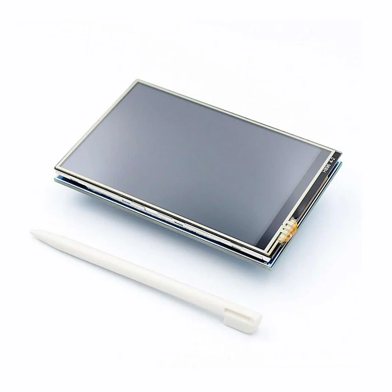
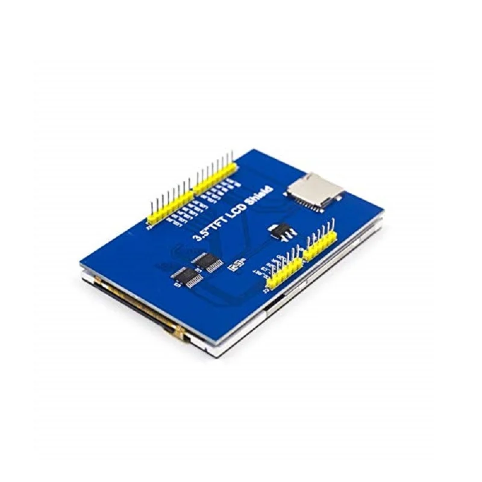
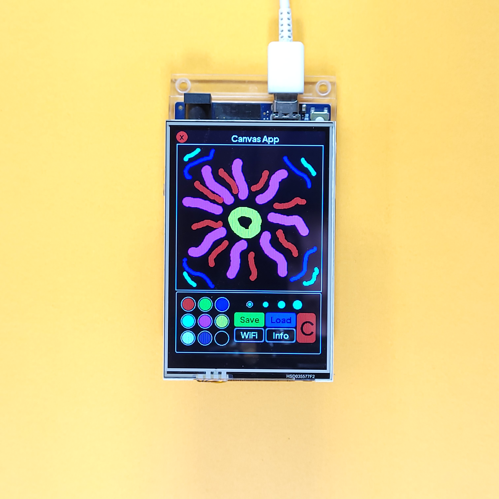
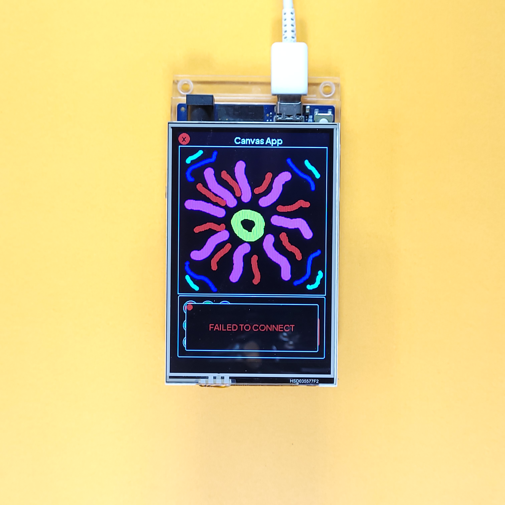
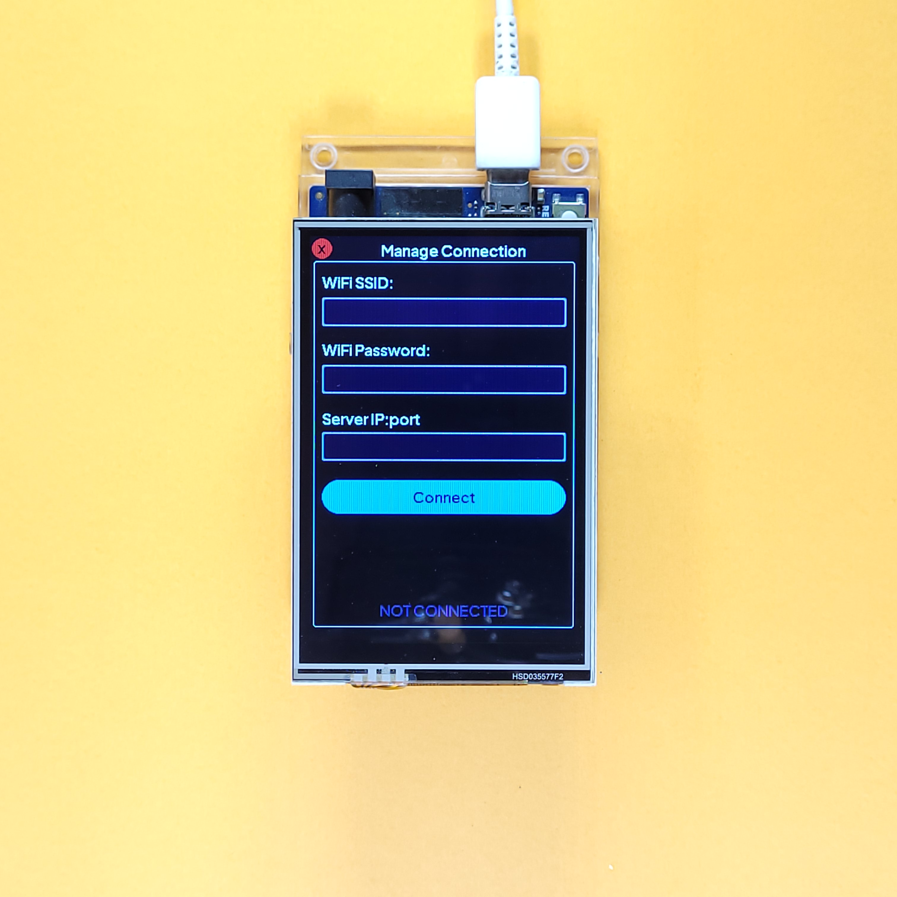
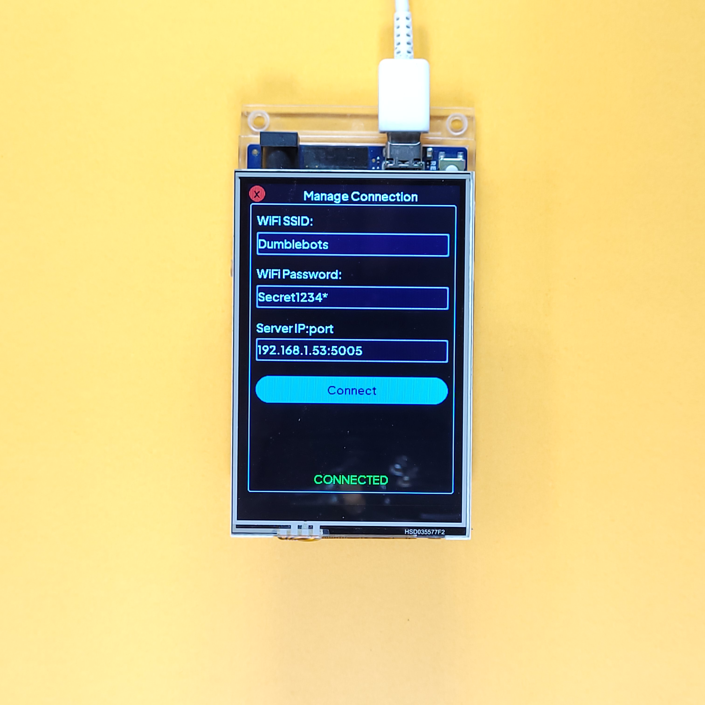
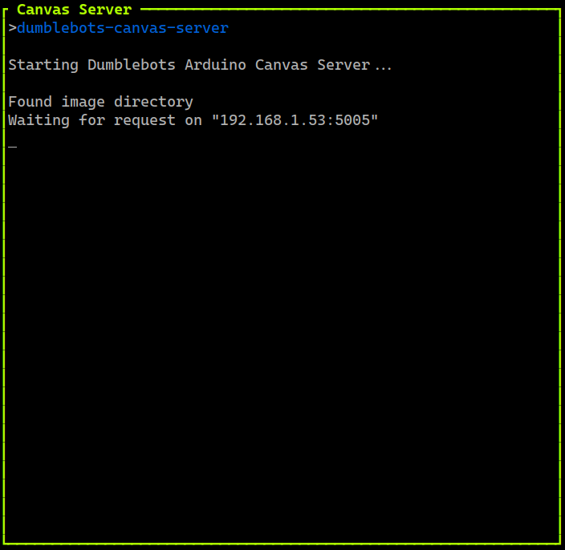

# Freely Paintable Canvas On Arduino UNO R4 WiFi and TFT LCD Touchscreen with WiFi Syncing


## Overview

This repository contains a program to create a **freely paintable canvas** with an **Arduino UNO R4 WiFi** and a **3.5" ILI9486 touch screen display shield**. The contents of the canvas can be **saved to and loaded from a server** running on your **PC/cloud VM**. Connections to WiFi can be made on the fly using a **full android-style keyboard**.

Overall, the project attempts to provide a **smartphone-like experience** using just the Arduino UNO R4 WiFi and Display Shield, both of which are relatively inexpensive and easy to acquire. This **enhances the ability of the Arduino to drive sensors and actuators**. Pictures of the App are included the following sections.
<!--! ADD LINK TO YOUTUBE VIDEO -->

|||
|:-:|:-:|
|||

Most 3.5" LCD Touch displays use the ILI9486 Display Driver and include a resistive touchscreen. **The PCB Layout & silkscreen text may vary slightly between displays. This does not change their behaviour and functionality.** This repository depends on the following libraries -

- [Adafruit Touch Screen Library](https://github.com/adafruit/Adafruit_TouchScreen) to manage touch input
- [Adafruit GFX Library](https://github.com/adafruit/Adafruit-GFX-Library/tree/master) for graphics primitives
- [This fork of the MCUFriend KBV library](https://github.com/slviajero/MCUFRIEND_kbv) to drive the display (this makes it compatible with the UNO R4)

The program has been written using PlatformIO, and has been tested to work on the [Arduino UNO R4 WiFi](https://docs.arduino.cc/hardware/uno-r4-wifi/).

**Note- While the drawing can be used without any connectivity, saving and loading require a WiFi network with its credentials known, as well as the server program (found at [this repository](https://github.com/Aditya-A-garwal/Arduino-WiFi-TFT-LCD-Canvas-Server)). The server can directly be installed using Rust too, as explained in the next section. It is a lightweight process and does not need any special hardware to run.**

For a simpler version of this program that works on the Arduino [UNO R4 Minima](https://docs.arduino.cc/hardware/uno-r4-minima/) and [UNO R3](https://docs.arduino.cc/hardware/uno-rev3/), see [this](https://github.com/Aditya-A-garwal/Arduino-TFT-LCD-3-5-Canvas-Paint).

> [!TIP]
> A detailed tutorial on how to use this repository **with video demonstration** is available [here](https://projecthub.arduino.cc/AdityaAg/create-a-smartphone-like-device-with-the-arduino-uno-r4-wifi-multiple-apps-keyboard-dynamic-wifi-cloud-sync-95ccec) on the Arduino Project Hub.

## Building/Uploading With PlatformIO

First, install the necessary libraries using the following command -

```shell
pio pkg install
```

Then, copy the pre-rendered custom fonts in the `Fonts/` directory to the appropriate directory within the Adafruit GFX library with the following command -

```shell
cp Fonts/* ".pio/libdeps/uno_r4_wifi/Adafruit GFX Library/Fonts"
```

Finally, run the following commands to build and upload the project -

```shell
pio run
pio run --target upload
```

Optionally, you can create the `include/arduino_secrets.h` file with the following macros -

```cpp
#define DEFAULT_SECRET_SSID "REPLACE WITH YOUR SSID"
#define DEFAULT_SECRET_PASS "REPLACE WITH YOUR PASS"
#define DEFAULT_SERVER_ADDR "0.0.0.0:0"
```

This file is not tracked by git and are used as default values for textboxes while connected to WiFi.

To save and load images, the server program has to be run on a machine that the Arduino can access over WiFi, such as your PC or a cloud VM with a public facing IP (and open ports). The server has been written in Rust and can be downloaded using [`cargo`](https://crates.io/) by simply running the following command-

```shell
rustup default nightly       # required
cargo install arduino-wifi-tft-lcd-server

# To view its useage
dumblebots-wifi-server -h

# To run it in the current directory on the default port (5005)
dumblebots-wifi-server
```

The source code for the server can be found [here](https://github.com/Aditya-A-garwal/Arduino-WiFi-TFT-LCD-Canvas-Server).

## Using the Project

After uploading the program and rebooting, the device may take 5-10 seconds to show movement, after which the display should show 3 apps, as shown below -

<div align="center">

||
|:-:|
|Home Screen|

</div>

The first app is the drawings are made on the canvas and saved/loaded from the server. It includes a Canvas, Color Selector, Stroke Size Selector and buttons to save, load, clear canvas, manage WiFi and view information, as shown below -

<div align="center">

||
|:-:|
|Canvas App|

</div>

At any time, the clear button (Big red button marked "C") can be used to clear the contents of the canvas. After the drawing has been made, the save button (green button marked "save") can be used to open a prompt from which 1 of 6 slots needs to be selected to save the drawing to. In reality, the program supports 256 slots but only 6 are shown in the GUI to maintain simplicity. If a slot is selected while the device is not connected to WiFi, the prompt will inform the user that a connection with the server could not be established, as shown -

<div align="center">
<table>
        <thead>
            <tr>
                <th width="31%"></th>
                <th width="31%"></th>
                <th width="31%"></th>
            </tr>
        </thead>
        <tbody>
            <tr>
                <td align="center">Drawing On the Canvas</td>
                <td align="center">Saving an Image</td>
                <td align="center">Connection Failure</td>
            </tr>
        </tbody>
    </table>
</div>

To connect to WiFi, click on the button marked WiFi (below save) or go to the "Device Settings" App in the home screen. Type the WiFi SSID, WiFi Password and Server Address in the boxes using the keyboard. The address is printed by the server when it starts. Entering an incorrect SSID/Password will result in a connection failure. Entering an incorrectly formatted address will also result in a failure. Finally, click on the connect button, as shown -

<div align="center" style="">
    <table>
        <thead>
            <tr>
                <th width="50%" ></th>
                <th width="50%" ></th>
            </tr>
        </thead>
        <tbody>
            <tr>
                <td align="center">WiFi Connection Form</td>
                <td align="center">Typing With Keyboard</td>
            </tr>
        </tbody>
    </table>
    <table>
        <thead>
            <tr>
                <th width="50%" ></th>
                <th width="50%" ></th>
            </tr>
        </thead>
        <tbody>
            <tr>
                <td align="center">Successful Connection</td>
                <td align="center">Server Showing Address</td>
            </tr>
        </tbody>
    </table>
</div>

Now, images can be saved and loaded from the server (as long as it is left running), as shown below -

<div align="center">

|||
|:-:|:-:|
|Image Saved|Image Loaded|

||
|:-:|
|Server Logs|

||
|:-:|
|Failed Communication|

</div>

The IP Address of the Device can be seen in the "Device Information" App.

<div align="center">

|||
|:-:|:-:|
|Before Connecting|After Connecting|

</div>

## Organization Of the Repository

Logically, the code is organized into three parts-

1. *GUI Framework*- This consists of various classes and interfaces to create a widget-tree in the app and automatically manage re-painting widgets and event propagation. Since display libraries usually only support drawing basic shapes/lines, having a **GUI framework greatly simplifies application development**. This is found in `lib/gui`.
2. *Touchscreen Controller*- This provides a single class to use the touchscreen. The class provided by this library is a wrapper around the Adafruit Touchscreen library and provides events for the GUI Framework. This is found `include/touchscreen_driver.h` and `src/touchscreen_driver.cpp`.
3. *Application Code*- This consists of the application, including the instantiation, placement, styling of widgets and callbacks. It can be found in `src/main.cpp`.


## Architecture

For a detailed look at the GUI framework's architecture, see [lib/gui/README.md](/lib/gui/README.md).
