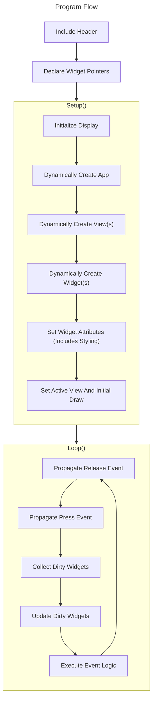
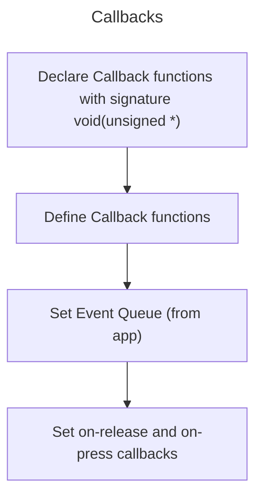

# GUI Framework For Canvas App

This directory contains the GUI framework that has been used to build the graphical portion of the Canvas App. The framework greatly abstracts over the graphics library and serves the following functions -

1. Facilitates the creation of a widget-tree.
2. Allows complex **layouting and styling** of widgets at runtime (**including overlapping windows**).
3. Automatically determines (to a large degree) what widgets are **dirty and re-paints them** when necessary (**while accounting for overlapping and intersecting widgets**) without an in-memory buffer.
4. Provides **event propagation** down the widget-tree.

## Interfaces Provided By the Framework

The framework provides the following interfaces (in [`include/widgets/widget.h`](/lib/gui/include/widgets/widget.h) and [`include/widgets/frame.h`](/lib/gui/include/widgets/frame.h))-

|Interface Name|Purpose|
|-:|-|
|[`BasicWidget`](/lib/gui/include/widgets/widget.h)|Must be implemented by all widgets.|
|[`InteractiveWidget`](/lib/gui/include/widgets/widget.h)|Must be implemented by all widgets that accept setting a callback for the press/release events.|
|[`DrawableWidget`](/lib/gui/include/widgets/widget.h)|Must be implemented by all widgets that other widgets can draw on.|
|[`Frame`](/lib/gui/include/widgets/frame.h)|Must be implemented by all widgets that can contain other widgets, such as Windows.|

## Default Widgets Provided by the Framework

The framework also provides the following basic set of widgets to speed up development -

|Name|Purpose|
|-:|-|
|[`Bitmap`](/lib/gui/include/widgets/bitmap.h)|Display arbitrary images.|
|[`Button`](/lib/gui/include/widgets/button.h)|Interactive button with text (includes styling).|
|[`Label`](/lib/gui/include/widgets/label.h)|Display non-interactive text (includes styling).|
|[`TextBox`](/lib/gui/include/widgets/textbox.h)|Display interactive text (includes styling).|
|[`Window`](/lib/gui/include/widgets/window.h)|Display floating windows, each with their own sub-tree of widgets (includes styling).|
|[`Keyboard`](/lib/gui/include/widgets/keyboard.h)|A full keyboard with shift key.|

The following widgets are also included, that are specific to this application -

- [`PenSizeSelector`](/include/widgets/pensizeselector.h)
- [`ColorSelector`](/include/widgets/colorselector.h)
- [`DrawableCanvas`](/include/widgets/drawablecanvas.h)

## Using/Extending the Framework

This section shows how to use/extend the framework with flowcharts and code snippets.

### Simple Example (Hello World)

The framework provides the `App` class, which acts as the root of the widget-tree. A single instance of this class is to be present for a single app. The app is the only widget in the tree to not have a parent and have a reference to the display. The entire GUI is then divided into `Views`, each consisting of a related group of widgets. A single view can have multiple widgets and overlapping windows too. An app must have a minimum of one view.

A minimal program to demonstrate this is shown below -

```arduino
#include "Arduino.h"

#include "Adafruit_GFX.h"
#include "MCUFRIEND_kbv.h"

#include "widgets/app.h"
#include "widgets/view.h"
#include "widgets/label.h"


MCUFRIEND_kbv tft;

App *app;

View *default_view;
Label *default_label;

void setup() {

    Serial.begin(9600);
    tft.begin(0x9486);

    app = App::create(&tft);
    if (app == nullptr) { while(1); } // app creation failed

    default_view = View::create(app);
    if (default_view == nullptr) { while(1); } // view creation failed

    default_label = Label::create(default_view, 10, 10, 240, 48);
    if (default_label == nullptr) { while(1); } // label creation failed

    default_label
    ->set_message("hello world")
    ->get_style()
    ->set_bg_color(BLACK)
    ->set_fg_color(WHITE)
    ->set_border_width(0);

    app
    ->make_active_view(default_view)
    ->draw();
}

void loop() {

    unsigned release_x, release_y, press_x, press_y;
    bool release_event {false}, press_event {false};
    //! ADD TOUCH CONTROLLER LOGIC HERE

    if (release_event) {
        app->propagate_release(release_x, release_y);
    }

    if (press_event) {
        app->propagate_press(press_x, press_y);
    }

    app
    ->collect_dirty_widgets()
    ->update_dirty_widgets()
    ->execute_event_logic();

    delay(10);
}
```

Generically represented by a flowchart -



### Callbacks (With Multiple Views)

All widgets that implement `InteractiveWidget` allow the registration of callbacks. The following example uses two buttons and callbacks to switch between views -

```arduino
#include "Arduino.h"

#include "Adafruit_GFX.h"
#include "MCUFRIEND_kbv.h"

#include "widgets/app.h"
#include "widgets/view.h"
#include "widgets/button.h"


MCUFRIEND_kbv tft;

App *app;

View *first_view;
Button *first_button;

View *second_view;
Button *second_button;

void first_button_cb(unsigned *args) {
    app->make_active_view(second_view);

    if (args != nullptr) {
        Serial.println(*(char *)args);
    }
}

void second_button_cb(unsigned *args) {
    app->make_active_view(first_view);

    if (args != nullptr) {
        Serial.println(*(char *)args);
    }
}

void setup() {

    Serial.begin(9600);
    tft.begin(0x9486);

    app = App::create(&tft);
    if (app == nullptr) { while(1); } // app creation failed

    first_view = View::create(app);
    if (first_view == nullptr) { while(1); } // view creation failed

    second_view = View::create(app);
    if (second_view == nullptr) { while(1); } // view creation failed

    first_button = Button::create(first_view, 10, 10, 150, 150);
    if (first_button == nullptr) { while(1); } // button creation failed

    second_button = Button::create(second_view, 10, 10, 150, 150);
    if (second_button == nullptr) { while(1); } // button creation failed

    first_button
    ->set_message("Goto 2")
    ->set_event_queue(app->get_event_queue())
    ->set_onrelease(first_button_cb)
    ->set_args((unsigned *)"one"); // optionally pass arguments

    second_button
    ->set_message("Goto 1")
    ->set_event_queue(app->get_event_queue())
    ->set_onrelease(second_button_cb)
    ->set_args((unsigned *)"two"); // optionally pass arguments

    app
    ->make_active_view(first_view)
    ->draw();
}

void loop() {

    unsigned release_x, release_y, press_x, press_y;
    bool release_event {false}, press_event {false};
    //! ADD TOUCH CONTROLLER LOGIC HERE

    if (release_event) {
        app->propagate_release(release_x, release_y);
    }

    if (press_event) {
        app->propagate_press(press_x, press_y);
    }

    app
    ->collect_dirty_widgets()
    ->update_dirty_widgets()
    ->execute_event_logic();

    delay(10);
}
```

In the above example, the callbacks will be called when the buttons are released, as this is a more a natural behavior as expected by humans, it is also possible to have the callbacks execute as soon as the buttons are pressed -

```diff
    first_button
    ->set_message("Goto 2")
    ->set_event_queue(app->get_event_queue())
-   ->set_onrelease(first_button_cb)
+   ->set_onpress(first_button_cb)
    ->set_args((unsigned *)"one"); // optionally pass arguments

    second_button
    ->set_message("Goto 1")
    ->set_event_queue(app->get_event_queue())
-   ->set_onpress(second_button_cb)
+   ->set_onrelease(second_button_cb)
    ->set_args((unsigned *)"two"); // optionally pass arguments
```

The steps to get callbacks working, summarized generically through a flowchart are shown below -




### Creating a Custom Widget

While the framework does provide a generous set of widgets to get started, many applications may need to define their own custom widgets. The following guidelines must be followed while creating widgets -

1. All widgets must implement the `BasicWidget` interface.
2. All widgets must maintain a flag to indicate if the widget has become dirty, i.e. it needs to be re-drawn. This flag must be set at the beginning of those methods which modify the state of the widget in such a way where it has to be re-drawn. This flag must be cleared at the beginning of the draw method.
3. All widgets must maintain a flag to indicate if the visibility has changed, i.e. it needs to be cleared/re-drawn. This flag must be set at the beginning of those methods which modify the visibility of the widget. This flag must be cleared at the beginning of the draw and clear methods.
4. All widgets that are not lead-nodes, i.e. they contain widgets within them, must implement the `Frame` interface.
5. All widgets that provide registration of callbacks for the fundamental events (press and release) must implement the `InteractiveWidget` interface.

2 and 3 are not implemented by default since some widgets and applications may choose to forego this/use an alternate for performance reasons.
